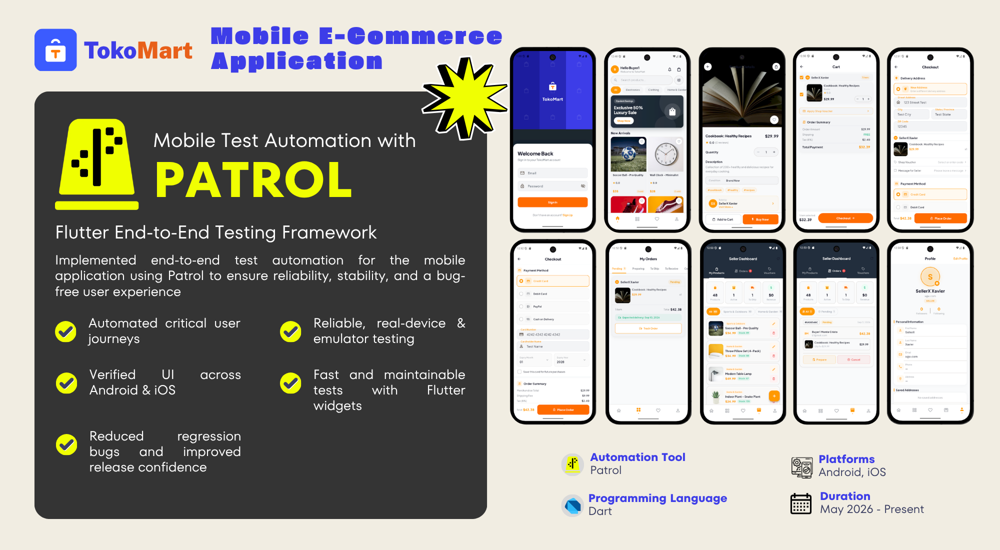

<div align="center">

<h1 class="work-title">
  <a href="https://github.com/cjp-engr/cjp-shopping-app/tree/main/frontend-mobile/patrol_test" target="_blank" rel="noopener">
    TokoMart Mobile E2E Tests (Patrol)
  </a>
</h1>

Patrol tests for the TokoMart Flutter mobile app.
  <div>
    
  </div>
    <br />
  <div>
    
  </div>
</div>


---

## Best Practices

### Structure

- **One test per file.** Each `*_test.dart` contains exactly one `testApp()` call.
- **Always use `testApp()`.** Never call `patrolTest()` directly — `testApp()` handles app boot, storage clear, and notification init.
- **TC-* ID in the file header.** First line must be a comment: `// TC coverage: TC-XXX`.
- **Write actions in the test file first.** Only extract to modules after the test passes. Rerun after every refactor to confirm it still passes.

### Locators

- **Always use `$(keys.feature.element)`.** Never hardcode strings or widget types.
- **Parameterized keys for list items.** Use `keys.feature.element(value)` when widgets are generated from dynamic data (variant rows, cart items, category options).
- **`find.text` only for assertions, never for taps.** If you need to tap something, it must have a key.
- **Keys live in `lib/features/<feature>/keys.dart`**, alphabetically sorted, registered in `lib/keys.dart`.

### Actions

- **No waits before or after `tap`, `enterText`, `scrollTo`.** Patrol auto-waits — adding `waitUntilVisible` before these is redundant and slows the suite.
- **Scroll before interacting with offscreen widgets.** Use `.scrollTo()` (or `.scrollTo(scrollDirection: AxisDirection.down)`) before tapping items below the fold.
- **Handle native dialogs immediately** after the action that triggers them. Use `$.platform.mobile.grantPermissionWhenInUse()` over manual native taps.

### Assertions

- **Assert only at the end of the test.** Do not assert after every action.
- **Prefer `waitUntilVisible` as the final assertion.** Use `expect()` only when visibility alone is not enough.
- **Shipping cost** is seller-configured — do not assert a flat `$9.99` or a free-over-$50 threshold. Assert `Free` when the seller chose free shipping, or the seller's configured fee amount when buyer pays. If the seller's config is unknown at assertion time, assert that a shipping line is visible rather than its value.

### Modules

- **Write to modules only after the test passes.** Premature extraction before a passing test adds risk.
- **Use descriptive method names, not comments.** A well-named method documents itself.
- **Split long module methods** when they represent multiple distinct logical steps that can each be named clearly.

---

## Prerequisites

- Flutter SDK installed
- Patrol CLI installed (`dart pub global activate patrol_cli`)
- Android emulator or physical device connected (`adb devices`)
- Backend running on `:5000` with seed data

```bash
cd backend && npm run seed && npm run dev
```

## Run

Single test:
```bash
cd frontend-mobile
patrol test --target patrol_test/<folder>/<file>_test.dart
```

All tests:
```bash
cd frontend-mobile
patrol test
```

With explicit credentials (if not set in `test_credentials.dart`):
```bash
patrol test --target patrol_test/0_auth/login_test.dart \
  --dart-define=EMAIL=test@example.com \
  --dart-define=TEST_PASSWORD=password123
```

## Structure

```
patrol_test/
├── test_app.dart           # testApp() wrapper — required by all tests
├── test_credentials.dart   # seed account credentials
├── test_bundle.dart        # imports all tests for full suite run
├── modules/
│   ├── module.dart         # base Module class
│   ├── modules.dart        # Modules aggregator
│   └── auth.dart           # Auth module (login, signup)
├── 0_auth/                 # Authentication tests
├── 1_seller/               # Seller flow tests
└── 2_buyer/                # Buyer flow tests
```

## Test coverage

### 0_auth — Authentication

| File | TC ID | Description |
|------|-------|-------------|
| `login_test.dart` | — | Logs in with seeded buyer account, verifies home screen |
| `signup_test.dart` | — | Signs up with valid data, lands on home screen |

### 1_seller — Seller Flows

| File | TC ID | Description |
|------|-------|-------------|
| `add_product_simple_test.dart` | TC-090 | Seller creates a simple product via 7-step wizard; shipping fee selection is required |
| `read_product_simple_test.dart` | TC-615 | Seller views simple product in seller dashboard |
| `edit_product_simple_test.dart` | TC-616 | Seller edits simple product from dashboard |
| `delete_product_simple_test.dart` | TC-617 | Seller deletes simple product from dashboard |
| `add_product_variant_test.dart` | TC-091 | Seller creates a variant product via 7-step wizard; shipping fee selection is required |
| `read_product_variant_test.dart` | TC-618 | Seller views variant product in seller dashboard |
| `edit_product_variant_test.dart` | TC-619 | Seller edits variant product from dashboard |
| `delete_product_variant_test.dart` | TC-620 | Seller deletes variant product from dashboard |

### 2_buyer — Buyer Checkout Flows

| File | TC ID | Description |
|------|-------|-------------|
| `simple_cod_checkout_test.dart` | TC-095 | Buyer places COD order (simple product) |
| `simple_saved_credit_checkout_test.dart` | TC-096 | Buyer checks out with saved credit card (simple product) |
| `simple_new_credit_checkout_test.dart` | TC-097 | Buyer checks out with new card entry (simple product) |
| `variant_cod_checkout_test.dart` | TC-101 | Buyer places COD order with variant product |
| `variant_new_credit_checkout_test.dart` | TC-103 | Buyer checks out with new card entry (variant product) |
| `variant_saved_credit_checkout_test.dart` | TC-104 | Buyer checks out with saved credit card (variant product) |

## Architecture

Each test file contains exactly one `testApp()` call. Test actions are written directly in the test file first, then extracted into modules after the test passes. See `modules/` for reusable flows.

- **Auth flows** → `modules/auth.dart`
- **Native interactions** → `$.platform` APIs (not `flutter_test`)
- **Widget locators** → `keys.*` from `lib/keys.dart` (never hardcoded strings)

Full architecture guide: `.claude/skills/patrol-test-architecture/`
